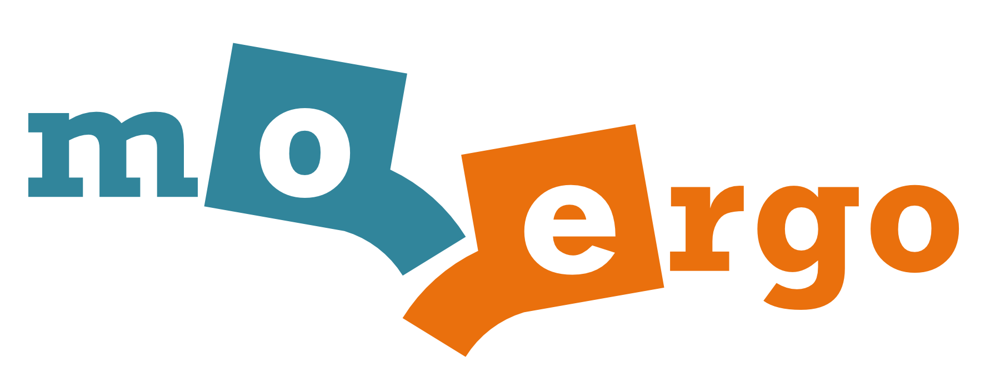

# MoErgo Glove80 Custom Configuration

This repo is the official configuration of the MoErgo Glove80 wireless split contoured keyboard. Use it to develop your own keymap and easily build your own ZMK firmware to run on your Glove80.

## Resources
- The [official Glove80 Glove80 Support](https://moergo.com/glove80-support) web site. Glove80 documentation and other technical resources.
- The [official MoErgo Discord Server](https://moergo.com/discord). Instant conversations with other MoErgo users.

- The [official ZMK Documentation](https://zmk.dev/docs) web site. Find the answers to many of your questions about ZMK Firmware.
- The [official ZMK Discord Server](https://discord.gg/8cfMkQksSB). Instant conversations with other ZMK developers and users. Great technical resource!

- The [official Glove80 ZMK Distribution](https://github.com/moergo-sc/zmk). Repositiory for ZMK firmware customized for Glove80. 
